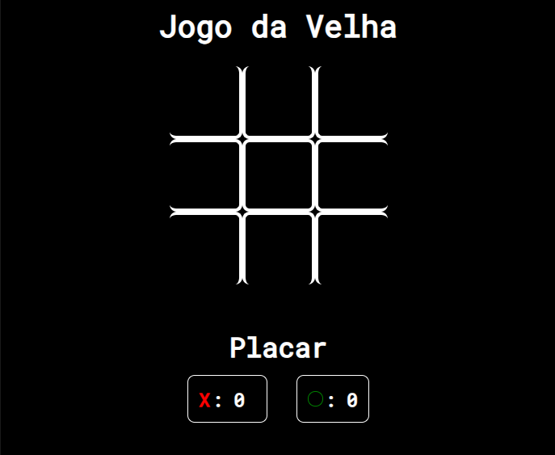

<h1 align="center"> Jogo da Velha </h1>

Projeto criado para fins de estudo, ministrado pelo professor Matheus Battisti do curso "JavaScript do básico ao avançado (c/ Node.js e projetos) " pela Udemy.

  <a href="#-tecnologias">Tecnologias</a>&nbsp;&nbsp;&nbsp;|&nbsp;&nbsp;&nbsp;
  <a href="#-projeto">Projeto</a>&nbsp;&nbsp;&nbsp;|&nbsp;&nbsp;&nbsp;

 

  

## 🚀 Tecnologias

Esse projeto foi desenvolvido com as seguintes tecnologias:

- HTML e CSS
- JavaScript

## 💻 Projeto

O Jogo da Velha tem como objetivo que cada participante, cada um com um símbolo: 'X' e 'O', alternam as jogadas e têm que formar uma linha reta com seus símbolos, seja ela vertical, horizontal ou diagonal. Aquele que fizer primeiro vence, ou seja, também é importante impedir que o oponente a faça antes. Neste projeto, também é possível jogar contra uma IA (Inteligencia Artificial).